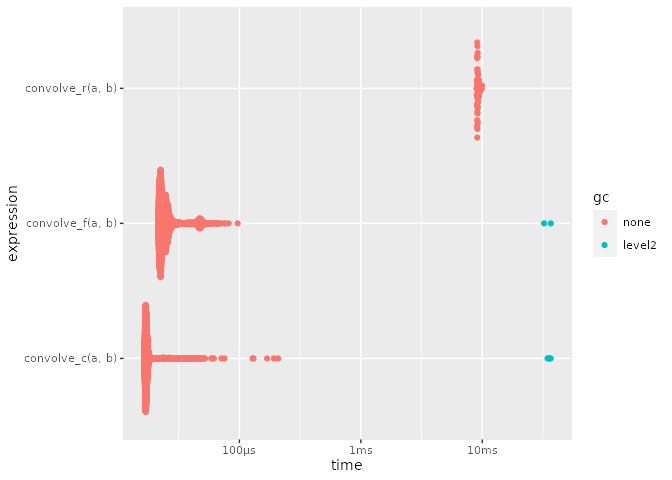

<!-- README.md is generated from README.Rmd. Please edit that file -->

# frast

<!-- badges: start -->

<!-- badges: end -->

`frast` is a prototype / proof-of-concept of two things:

1)  An R-to-Fortran transpiler
2)  A just-in-time (JIT) compiler for R functions

It takes an R function and compiles it to fast machine code, by way of transpiling it to Fortran. 

R functions are translated to Fortran subroutines, which are
then compiled as a stand-alone Fortran 2018 module. Compilation is
performed using gfortran. The compiled shared object is then dynamically
loaded using `dyn.load()`, and the compiled function in the loaded object
can then be evaluated using `RFI::.ModernFortran`.

Some potential next steps:
  + compile w/ llvm-jit toolchain (ala llvmlite/numba) instead of gfortran.
  + remove the need for explicit type manifests in R. (note-to-self: see if it's
easy to recycle the implementation in `package:memoise`). A solid approach would
be to add a check before `eval`ing the R function, to check if a compiled
version of that function matching the calling arguments signature is available.
If not, launch a background task compiling (so it will be available next time
the function is evaluated) but proceed with evaluating the R function as normal.
This will require forcing of all promises, but that should be a small price to
pay for the speed boost. Also, investigate if the signature matching in S4 or R7 is flexible enough for this, or if this would require rolling a custom implementation for dispatching + caching methods.
  + autogrenerate R wrappers for R package authors, integrate transpilation to Fortran with `R CMD build` so that 
    packages users don't have to manage the generated Fortran files at all, while still giving package users
    the benefits of a package that contains (auto-generated, fast, AOT compiled) Fortran subroutines.


## Example

This is a basic example

``` r
library(frast)
library(RFI)

addone <- function(x) {
  manifest(Var(x, "d", shape = ":"))
  x = x + 1
}
```

``` r
(ptr <- load_so(addone))
#> module mod_addone
#> 
#>     use iso_c_binding, only: c_int, c_double, c_double_complex, c_bool
#>     implicit none
#> 
#>   contains
#> 
#>     subroutine addone(x) bind(c)
#> real(c_double) :: x(:)
#> x = x + 1
#> end subroutine addone
#> 
#>   end module mod_addone
#> <pointer: 0x7f9ce7d35120>
#> attr(,"class")
#> [1] "NativeSymbol"
RFI::.ModernFortran(ptr, array(1))
#> [[1]]
#> [1] 2
# .Fortran(ptr, array(1))
```

Lets compile a convolve function.

``` r

convolve_r <- function(a, b) {
  ab = double(length(a) + length(b) - 1)
  for (i in seq_along(a))
    for (j in seq_along(b))
      ab[i + j - 1] = ab[i + j - 1] + a[i] * b[j]
    ab
}

convolve_rf <- function(a, b, ab) {
  manifest(
    Var(i, "i"),
    Var(j, "i"),
    Var(a, "d", 1, modifiable = FALSE),
    Var(b, "d", 1, modifiable = FALSE),
    Var(ab, "d", 1, modifiable = TRUE)
  )
  for (i in seq_along(a))
    for (j in seq_along(b))
      ab[i + j - 1] = ab[i + j - 1] + a[i] * b[j]
}
```

Here is what it looks like translated to Fortran:

``` r
frast:::translate(convolve_rf)
#> subroutine convolve_rf(a,b,ab) bind(c)
#> integer(c_int) :: i
#> integer(c_int) :: j
#> real(c_double), intent(in) :: a(:)
#> real(c_double), intent(in) :: b(:)
#> real(c_double), intent(in out) :: ab(:)
#> do i = 1, size(a)
#> do j = 1, size(b)
#> ab(i + j - 1) = ab(i + j - 1) + a(i) * b(j)
#> end do
#> end do
#> end subroutine convolve_rf
```

and also compare it to some alternative approaches to see what the
speedup is.

``` r
convolve_c_ <- inline::cfunction(
  signature(
    a = "double",
    na = "integer",
    b = "double",
    nb = "integer",
    ab = "double"
  ),
  body = "
//void convolve(double *a, int *na, double *b, int *nb, double *ab)
{
    int nab = *na + *nb - 1;

    for(int i = 0; i < nab; i++)
        ab[i] = 0.0;
    for(int i = 0; i < *na; i++)
        for(int j = 0; j < *nb; j++)
            ab[i + j] += a[i] * b[j];
}", convention = ".C")

convolve_c <- function(a, b) {
  convolve_c_(a, length(a), b, length(b), 
              double(length(a) + length(b) - 1))[[5L]]
}

convolve_r <- function(a, b) {
  ab = double(length(a) + length(b) - 1)
  for (i in seq_along(a))
    for (j in seq_along(b))
      ab[i + j - 1] = ab[i + j - 1] + a[i] * b[j]
    ab
}

convolve_rf <- function(a, b, ab) {
  manifest(
    Var(i, "i"),
    Var(j, "i"),
    Var(a, "d", 1, modifiable = FALSE),
    Var(b, "d", 1, modifiable = FALSE),
    Var(ab, "d", 1, modifiable = TRUE)
  )
  for (i in seq_along(a))
    for (j in seq_along(b))
      ab[i + j - 1] = ab[i + j - 1] + a[i] * b[j]
}

ptr <- load_so(convolve_rf)
#> module mod_convolve_rf
#> 
#>     use iso_c_binding, only: c_int, c_double, c_double_complex, c_bool
#>     implicit none
#> 
#>   contains
#> 
#>     subroutine convolve_rf(a,b,ab) bind(c)
#> integer(c_int) :: i
#> integer(c_int) :: j
#> real(c_double), intent(in) :: a(:)
#> real(c_double), intent(in) :: b(:)
#> real(c_double), intent(in out) :: ab(:)
#> do i = 1, size(a)
#> do j = 1, size(b)
#> ab(i + j - 1) = ab(i + j - 1) + a(i) * b(j)
#> end do
#> end do
#> end subroutine convolve_rf
#> 
#>   end module mod_convolve_rf

convolve_f <- function(a, b) {
  .ModernFortran(ptr, a, b, double(length(a) + length(b) - 1),
                 DUP = FALSE)[[3L]]
}

a <- runif(1024)
b <- runif(32)
all.equal(convolve_r(a, b), convolve_f(a, b))
#> [1] TRUE
all.equal(convolve_r(a, b), convolve_c(a, b))
#> [1] TRUE

r <- bench::mark(convolve_f(a, b), 
                 convolve_c(a, b), 
                 convolve_r(a, b))
```

``` r
plot(r)
#> Loading required namespace: tidyr
```



``` r
sessioninfo::session_info()
#> ─ Session info ───────────────────────────────────────────────────────────────
#>  setting  value                       
#>  version  R version 4.0.2 (2020-06-22)
#>  os       Ubuntu 20.04.1 LTS          
#>  system   x86_64, linux-gnu           
#>  ui       X11                         
#>  language (EN)                        
#>  collate  en_US.UTF-8                 
#>  ctype    en_US.UTF-8                 
#>  tz       America/New_York            
#>  date     2020-08-09                  
#> 
#> ─ Packages ───────────────────────────────────────────────────────────────────
#>  package     * version    date       lib source                     
#>  assertthat    0.2.1      2019-03-21 [1] CRAN (R 4.0.2)             
#>  beeswarm      0.2.3      2016-04-25 [1] CRAN (R 4.0.2)             
#>  bench         1.1.1      2020-01-13 [1] CRAN (R 4.0.2)             
#>  cli           2.0.2      2020-02-28 [1] CRAN (R 4.0.2)             
#>  colorspace    1.4-1      2019-03-18 [1] CRAN (R 4.0.2)             
#>  crayon        1.3.4      2017-09-16 [1] CRAN (R 4.0.2)             
#>  digest        0.6.25     2020-02-23 [1] CRAN (R 4.0.2)             
#>  dplyr         1.0.1      2020-07-31 [1] CRAN (R 4.0.2)             
#>  ellipsis      0.3.1      2020-05-15 [1] CRAN (R 4.0.2)             
#>  evaluate      0.14       2019-05-28 [1] CRAN (R 4.0.2)             
#>  fansi         0.4.1      2020-01-08 [1] CRAN (R 4.0.2)             
#>  farver        2.0.3      2020-01-16 [1] CRAN (R 4.0.2)             
#>  frast       * 0.0.0.9000 2020-08-09 [1] local                      
#>  generics      0.0.2      2018-11-29 [1] CRAN (R 4.0.2)             
#>  ggbeeswarm    0.6.0      2017-08-07 [1] CRAN (R 4.0.2)             
#>  ggplot2       3.3.2      2020-06-19 [1] CRAN (R 4.0.2)             
#>  glue          1.4.1      2020-05-13 [1] CRAN (R 4.0.2)             
#>  gtable        0.3.0      2019-03-25 [1] CRAN (R 4.0.2)             
#>  htmltools     0.5.0      2020-06-16 [1] CRAN (R 4.0.2)             
#>  inline        0.3.15     2018-05-18 [1] CRAN (R 4.0.2)             
#>  knitr         1.29       2020-06-23 [1] CRAN (R 4.0.2)             
#>  lifecycle     0.2.0      2020-03-06 [1] CRAN (R 4.0.2)             
#>  magrittr      1.5        2014-11-22 [1] CRAN (R 4.0.2)             
#>  munsell       0.5.0      2018-06-12 [1] CRAN (R 4.0.2)             
#>  pillar        1.4.6      2020-07-10 [1] CRAN (R 4.0.2)             
#>  pkgconfig     2.0.3      2019-09-22 [1] CRAN (R 4.0.2)             
#>  profmem       0.5.0      2018-01-30 [1] CRAN (R 4.0.2)             
#>  purrr         0.3.4      2020-04-17 [1] CRAN (R 4.0.2)             
#>  R6            2.4.1      2019-11-12 [1] CRAN (R 4.0.2)             
#>  ragg          0.3.1.9000 2020-08-09 [1] Github (r-lib/ragg@2f081db)
#>  RFI         * 0.0.0.9000 2020-08-09 [1] local                      
#>  rlang         0.4.7      2020-07-09 [1] CRAN (R 4.0.2)             
#>  rmarkdown     2.3        2020-06-18 [1] CRAN (R 4.0.2)             
#>  scales        1.1.1      2020-05-11 [1] CRAN (R 4.0.2)             
#>  sessioninfo   1.1.1      2018-11-05 [1] CRAN (R 4.0.2)             
#>  stringi       1.4.6      2020-02-17 [1] CRAN (R 4.0.2)             
#>  stringr       1.4.0      2019-02-10 [1] CRAN (R 4.0.2)             
#>  systemfonts   0.2.3      2020-06-09 [1] CRAN (R 4.0.2)             
#>  tibble        3.0.3      2020-07-10 [1] CRAN (R 4.0.2)             
#>  tidyr         1.1.1      2020-07-31 [1] CRAN (R 4.0.2)             
#>  tidyselect    1.1.0      2020-05-11 [1] CRAN (R 4.0.2)             
#>  vctrs         0.3.2      2020-07-15 [1] CRAN (R 4.0.2)             
#>  vipor         0.4.5      2017-03-22 [1] CRAN (R 4.0.2)             
#>  withr         2.2.0      2020-04-20 [1] CRAN (R 4.0.2)             
#>  xfun          0.16       2020-07-24 [1] CRAN (R 4.0.2)             
#>  yaml          2.2.1      2020-02-01 [1] CRAN (R 4.0.2)             
#> 
#> [1] /home/tomasz/.local/lib/R/site-library
#> [2] /home/tomasz/.local/lib/R/library
sessioninfo::platform_info()
#>  setting  value                       
#>  version  R version 4.0.2 (2020-06-22)
#>  os       Ubuntu 20.04.1 LTS          
#>  system   x86_64, linux-gnu           
#>  ui       X11                         
#>  language (EN)                        
#>  collate  en_US.UTF-8                 
#>  ctype    en_US.UTF-8                 
#>  tz       America/New_York            
#>  date     2020-08-09
```
